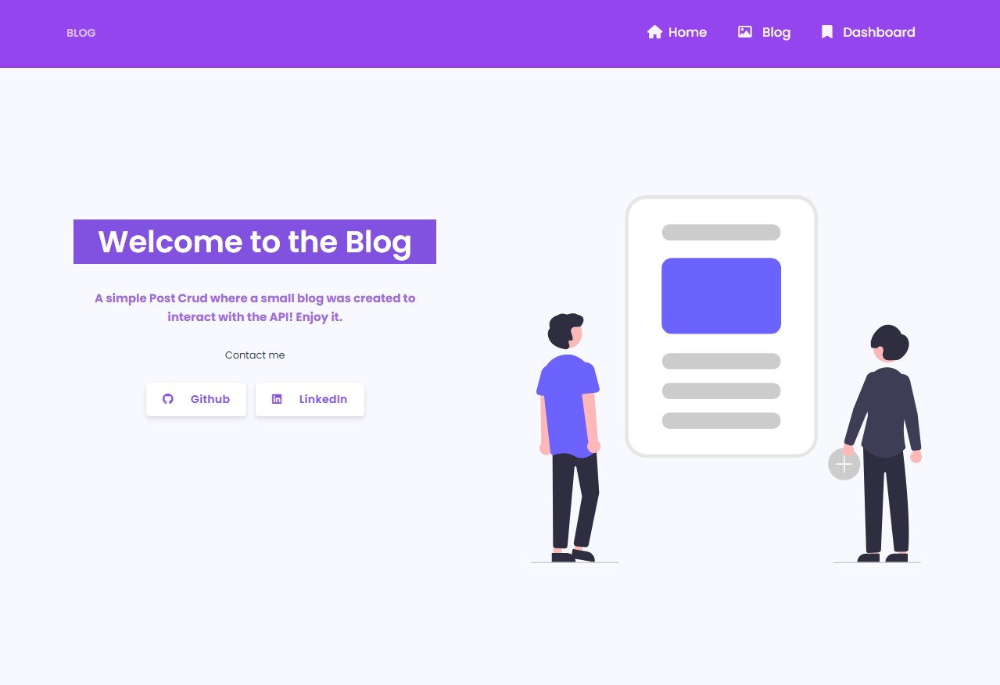
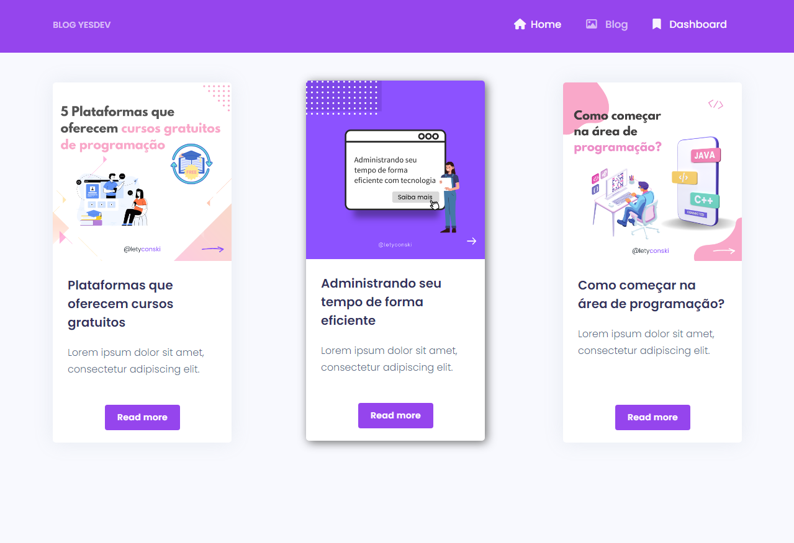
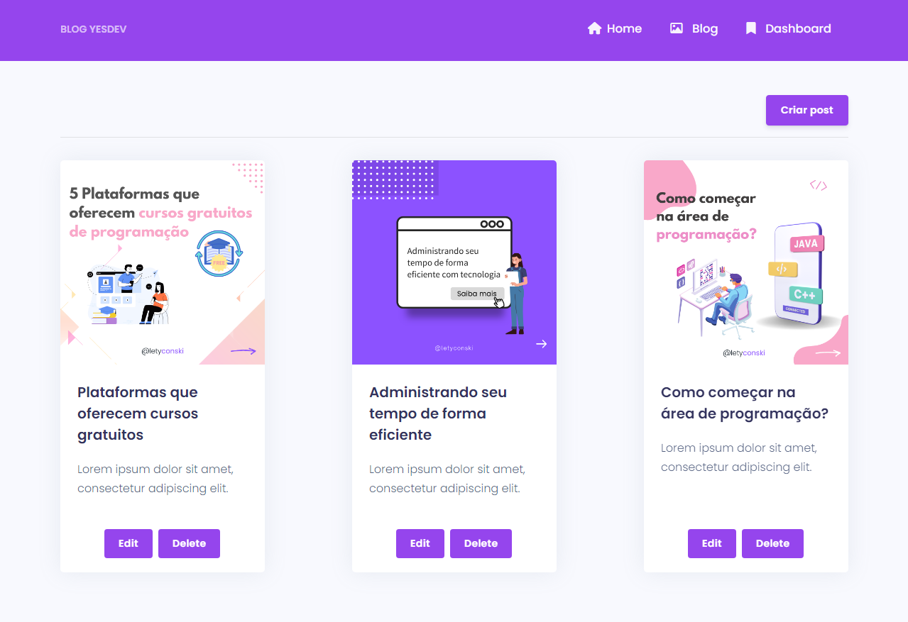
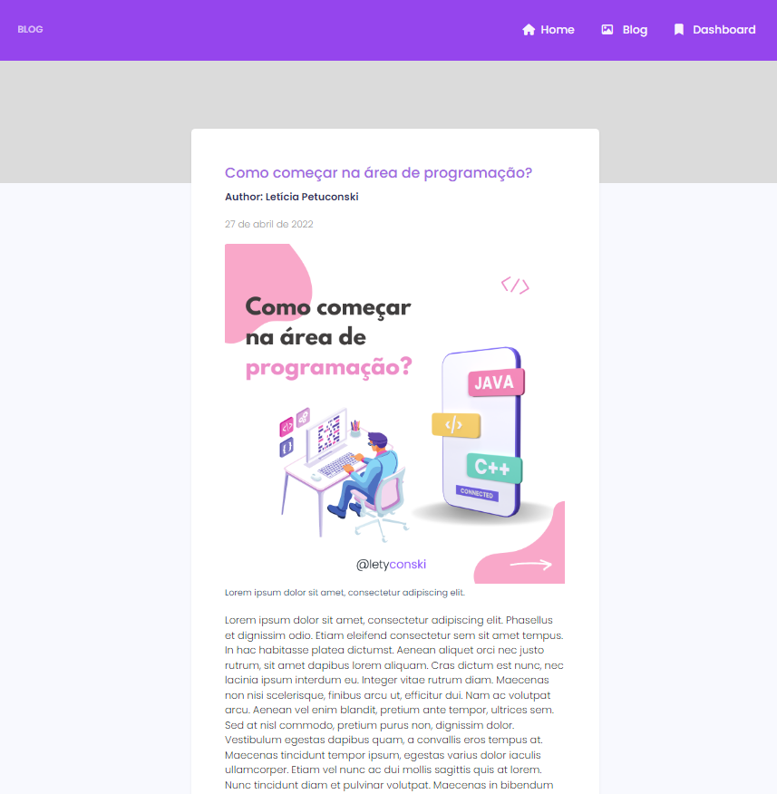
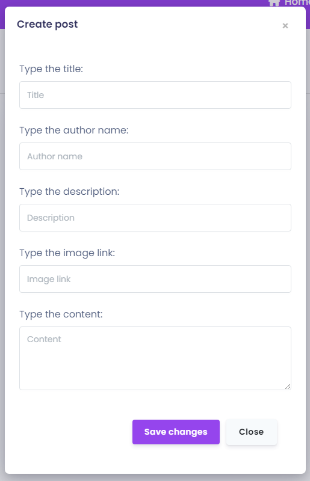
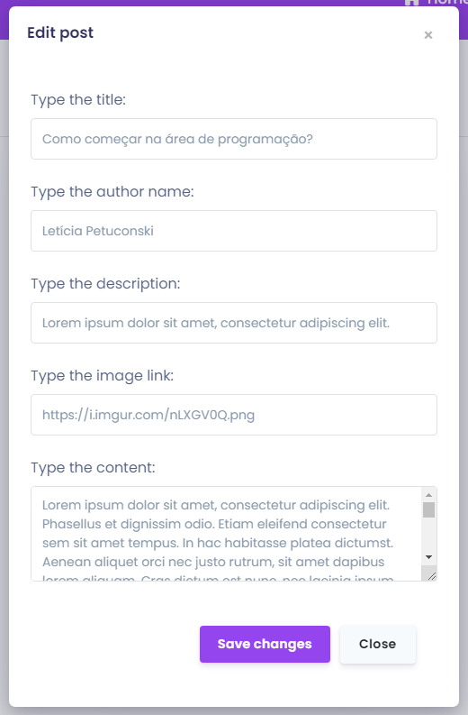

# Blog | Crud

Blog | Crud feito em **Nuxt.js**.

Sobre mim 👇

```json
{
    "nome": "Letícia Petuconski",
    "idade": "23 anos",
    "hobbies": "Estudar, ler e aprender algo novo",
    "sobre": "Comecei a estudar programação desde 2019 em um curso técnico de Informática para Internet. Atualmente faço faculdade de Ciência de Dados, onde ambas as áreas tenho interesse em seguir carreira",
    "habilidades": "Responsabilidade, Comprometimento, Resiliência, Foco no Resultado"
}

```

**Obs:**  
- A intenção desse projeto não é focar no front-end, ou seja, não está responsivo.
- Pretendo dar continuidade no desenvolvimento desse projeto, trazendo melhorias.


### Desafios encontrados:
- Integração da API com o front-end
- Utilizar slugify no front-end

## 🚀 Começando

Essas instruções permitirão que você obtenha uma cópia do projeto em operação na sua máquina local para fins de desenvolvimento.

### 📋 Pré-requisitos

```
♦ Node.js
♦ NPM ou Yarn
```

### 🔧 Instalação | Projeto Nuxt e API

```
npm install
```

```
npm run dev
```

## 📦 Desenvolvimento

- Para testar a aplicação utilizaria um package de testes e utilizei o insomnia para testar a API.

- Para rodar a aplicação é necessário fazer a instalação como mostra no bloco anterior.

- Na construção do projeto, foi utilizada uma API própria feita em **Express.js**, [disponível aqui](https://github.com/LePetuconski/Api-Blog).

## 🛠️ Construído com

Projeto Nuxt:

* [Nuxt.js](https://nuxtjs.org/)
* [Vue.js](https://vuejs.org/) 
* [jQuery](https://jquery.com/) 
* [Argon.css](https://demos.creative-tim.com/argon-dashboard/docs/getting-started/overview.html) 

API:

* [Express.js](https://expressjs.com)
* [Sequelize.js](https://sequelize.org)
* [SQLite](https://www.sqlite.org/)


## 📌 Versão

Usei [Git](https://git-scm.com/) para controle de versão.

## ✒️ Autores/Colaboradores

* **Letícia Petuconski** - *Dev* - [LePetuconski](https://github.com/LePetuconski)

## 📄 Licença

Este projeto está sob a licença - veja o arquivo [LICENSE.md](link) para detalhes.

## 💻 Telas do Projeto

Tela: Home


Tela: Blog


Tela: Dashboard


Tela: Read More



Tela: Create Post | Modal



Tela: Edit Post | Modal


